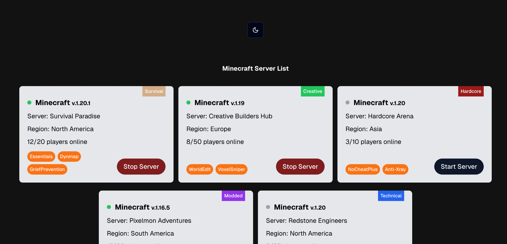

# Minecraft Server Dashboard

A web application to display and manage Minecraft servers. Each server card provides details about the server, such as its version, region, number of players, status, and mods. Users can start or stop servers directly from the dashboard.

## Features

-   **Server Overview**: View detailed information about Minecraft servers, including:
    -   Server Name
    -   Version
    -   Region
    -   Player Count
    -   Status (Online/Offline)
    -   Type (e.g., Survival, Creative, Hardcore)
    -   Mods Installed
-   **Dynamic Status Updates**: Start or stop a server with a single button click.
-   **Responsive Design**: Fully responsive layout, suitable for both desktop and mobile devices.
-   **Dark Mode**: A sleek dark-themed interface for better visibility and aesthetics.

## Screenshot



## Technologies Used

-   **Frontend**:
    -   [Next.js](https://nextjs.org/)
    -   [TailwindCSS](https://tailwindcss.com/)
    -   [shadcn/ui](https://ui.shadcn.com/)
    -   [clsx](https://github.com/lukeed/clsx)
-   **UI Components**:
    -   Custom `Button` component for user interactions.
    -   Server cards displaying server details.

## Getting Started

### Prerequisites

-   Node.js (v16+)
-   Yarn or npm

### Installation

1. Clone the repository:

    ```bash
    git clone git@github.com:namoon0608/game-server.git
    cd game-server
    ```

2. Install dependencies:

    ```bash
    yarn install
    ```

    or

    ```bash
    npm install
    ```

3. Start the development server:

    ```bash
    yarn dev
    ```

    or

    ```bash
    npm run dev
    ```

4. Open the app in your browser:
    ```
    http://localhost:3000
    ```

### Deployment

The application is deployed on Vercel. You can access it using the following URL:

[Game Server Management App](https://game-server-tau.vercel.app/)

1. Build the application:

    ```bash
    yarn build
    ```

    or

    ```bash
    npm run build
    ```

2. Start the production server:
    ```bash
    yarn start
    ```
    or
    ```bash
    npm start
    ```

## How to Use

1. View the list of servers in the dashboard.
2. Each server card displays detailed information about the server.
3. Use the "Start Server" or "Stop Server" button to change the server's status.
4. The server status and indicator will update dynamically.

## Project Structure

```
src/
├── components/
│   ├── ServerCard.tsx      # Displays server information and actions
│   ├── modeToggle.tsx      # Trigger for Dark mode
│   ├── theme-provider.tsx  # Theme attributes for child components
│   ├── ui/
│   │   └── Button.tsx      # Reusable button component
├── app/
│   ├── globals.css         # Global styles
│   └── page.tsx            # Main dashboard page
tailwind.config.ts          # TailwindCSS configuration
```

## License

This project is licensed under the MIT License. See the [LICENSE](./LICENSE) file for details.

```

```
